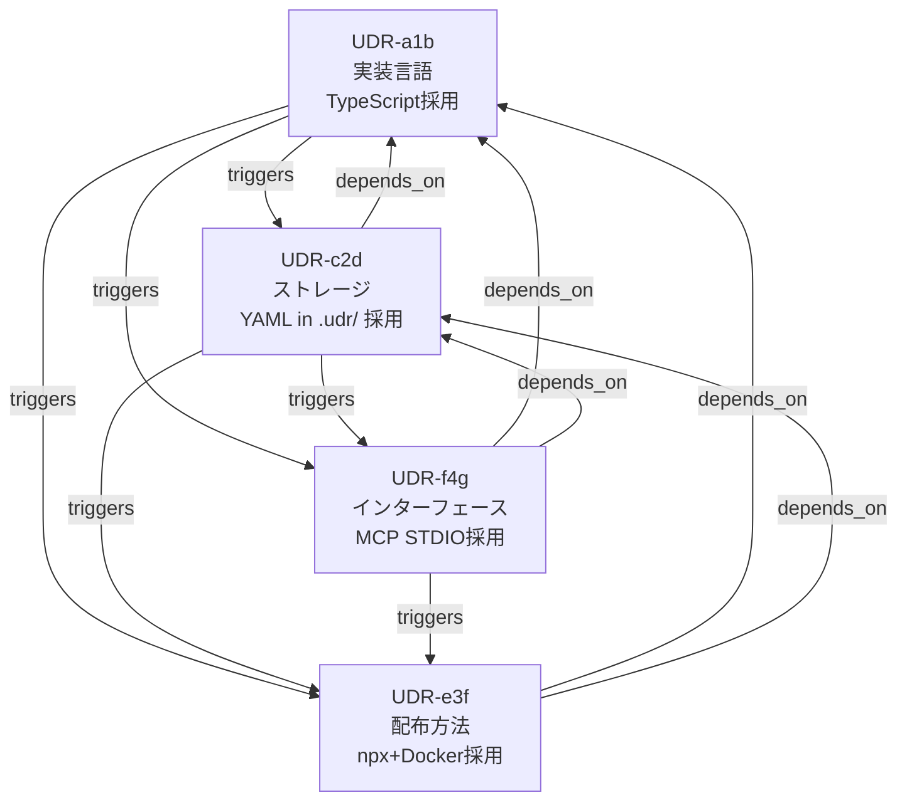

# UDR 実装方法検討結果報告書

> **バージョン**: v1.0
> **日付**: 2026-04-03
> **ステータス**: DECIDED
> **対象読者**: PM・SE・顧客
> **目的**: UDR実装方法の検討結果と決定内容の共有
> **位置づけ**: Phase 2 基盤構築の実装判断記録

---

## 1. 検討の背景

要求定義一覧（v1.3）では成果物を「TypeScriptで実装するMCP Server」と記載していたが、
以下の観点から改めて検討が必要との指摘を受け、実装方法を包括的に再検討した。

| 観点 | 内容 |
|------|------|
| 環境多様性 | Windows端末（.NET親和性高）/ macOS / Linux / AWS が混在 |
| Docker化 | コンテナ環境でのCI/CD統合の需要 |
| 保存場所 | UDRファイルをどこに・どの形式で保存するか |

本検討では、UDRシステム自身の実装判断を **UDR（Universal Decision Record）フォーマット**の様式に
沿って記録した。ただし本書執筆時点（v1.0、Phase 1 PoC 開始前）では `udr-record` skill 自体が
まだ存在せず、`.udr/records/` への実ファイル永続化は行っていない。**下表の UDR ID は本書内でのみ
使われる識別用の仮 ID であり、`.udr/records/` には対応する実ファイルは存在しない。** 実際のドッグ
フーディング運用（`.udr/records/` への記録）は Phase 1 PoC 開始後（2026-06 以降）の判断から開始
している（`.udr/records/` 参照）。

---

## 2. 検討した意思決定の一覧

| UDR ID（本書内の仮 ID、実ファイルなし） | 判断テーマ | 決定内容 |
|--------|---------|---------|
| UDR-UDR-20260403T1307-a1b | 実装言語・ランタイム選定 | **TypeScript / Node.js** |
| UDR-UDR-20260403T1308-c2d | ストレージ・保存場所選定 | **YAMLファイル in .udr/ (Git管理)** |
| UDR-UDR-20260403T1309-e3f | 配布・デプロイ方法選定 | **npx (プライマリ) + Docker (セカンダリ)** |
| UDR-UDR-20260403T1400-f4g | インターフェース実装方式選定 | **MCP Server STDIO**（Agent Plugins は Phase 2 拡張で補完） |

---

## 3. 各決定の要約

### 3.1 実装言語・ランタイム: TypeScript / Node.js（採用）

**検討した選択肢**: TypeScript/Node.js、.NET/C#、Python、Go

**採用の主な理由**:
- MCP（Model Context Protocol）公式SDKがTypeScriptをファーストクラスサポート
- `npx @axis/udr-mcp-server` での一発起動が可能
- クロスプラットフォーム対応（Windows / macOS / Linux / Docker 全対応）
- AXIS Agent SDKと技術スタックが統一できる

**棄却された主な選択肢**:

| 選択肢 | 棄却理由 |
|--------|---------|
| .NET / C# | MCP公式SDKのC#サポートが非成熟、npx相当の一発起動体験が困難 |
| Python | Windows環境でのPython環境構築が複雑、技術スタック分断コスト |
| Go | MCP公式GoSDKが非公式、チームにGo経験者がほぼいない |

**Windows端末への対応**: nvm-windowsを使ったNode.jsセットアップ手順をREADMEに明記する。

---

### 3.2 ストレージ・保存場所: YAMLファイル in `.udr/`（採用）

**検討した選択肢**: YAMLファイル/Gitトラッキング、SQLite、クラウドストレージ、JSON

**採用の主な理由**:
- GitでのPRレビュー時にUDR変更のdiffが確認できる（判断の透明性）
- AIエージェントがMCP Server停止中でも直接ファイルを読める（コンパクション耐性）
- 人間・AIともにスキャンで要点を掴める（YAML形式の可読性）
- バックアップがGitリポジトリのcloneだけで完了

**棄却された主な選択肢**:

| 選択肢 | 棄却理由 |
|--------|---------|
| SQLite | バイナリファイルでGit diffが確認困難、Phase 2では過剰スペック |
| クラウドストレージ | オフライン利用不可、コードリポジトリとの分離 |
| JSON | コメント記述不可、人間のスキャン可読性がYAMLより低い |

**将来の移行**: 500件超になった時点でSQLite移行を検討（REQ-NF-05）。

---

### 3.3 配布・デプロイ方法: npx + Docker（採用）

**検討した選択肢**: npx、Docker、npm global install、シングルバイナリ、AWS Lambda

**採用の主な理由**:
- `npx -y @axis/udr-mcp-server` で最小限のセットアップを実現
- Dockerイメージ（`ghcr.io/axis/udr-mcp-server`）でAWS/CI環境に対応
- 全ツールチェーン（Claude Code / Copilot / Cursor / Windsurf）で同一設定が使える

**配布戦略**:
```
Phase 2 MVP:  npx @axis/udr-mcp-server（全環境対応）
Phase 2 拡張: ghcr.io/axis/udr-mcp-server（クラウド・CI環境向け）
Phase 3以降:  AWS Lambda（MCP over HTTP）— スコープ外
```

**棄却された主な選択肢**:

| 選択肢 | 棄却理由 |
|--------|---------|
| npm global | バージョン管理が手動、npxで代替可能 |
| シングルバイナリ | クロスコンパイルで配布コスト増大 |
| AWS Lambda | Phase 2スコープを超える複雑度 |

---

### 3.4 インターフェース実装方式: MCP Server STDIO（採用）

**検討した選択肢**: MCP Server STDIO、Agent Plugins（Skills+Hooks）、MCP Server HTTPS、CLI ツール

**追加検討の背景**:
MCP Serverが前提設計だったが「Skills + Hook を組み合わせた Agent Plugins の方がMVP段階ではシンプルかつメンテしやすい可能性がある」との指摘を受け、比較検討した。

**採用の主な理由**:
- STDIO方式は認証・証明書管理が不要（HTTPSの複雑さを回避）
- 全ツールチェーン（Claude Code / Copilot / Cursor / Windsurf）がSTDIO対応済み
- Phase 3でのHTTPS移行パスが明確（設定ファイルの変更量が最小）

**棄却された主な選択肢**:

| 選択肢 | 棄却理由 |
|--------|---------|
| Agent Plugins（Skills+Hooks） | HooksはClaude Code専用（Copilot/Cursor/Windsurf非対応）。Skill単体ではCRUD・DAG検索が実装不可 |
| MCP Server HTTPS | TLS証明書・認証管理が必要でスモールスタートに不向き（Phase 3以降で検討） |
| CLI ツール | AIツールからの型安全な呼び出しができない |

**Agent Plugins（Skills+Hooks）との関係**:

```
Phase 2 MVP:   MCP Server STDIO（主インターフェース）
                + Skill（Phase 1 からの継続）
Phase 2 拡張:  MCP Server STDIO + Hook（コミット連携トリガー）
Phase 3 自動化: MCP Server STDIO + Agent SDK + Hook
Phase 4+:      MCP Server HTTPS（チーム共有サーバー）
```

Agent Plugins は「MCP Server と排他」ではなく「MCP を補完するEvent-drivenトリガー」として Phase 2 拡張以降で活用する。

---

## 4. 判断の依存関係（DAG）



トポロジカル順序: `a1b（言語）→ c2d（ストレージ）→ f4g（インターフェース）→ e3f（配布）`

---

## 5. UDRサンプルファイルの構造（想定、本書執筆当時は未実装）

当時想定していたUDRファイル構成は以下の通り（1 節に記載の通り、実ファイルは生成していない。
実際に確立された構成は `.claude/skills/_udr-shared/CONVENTIONS.md §1` を参照。実配置は
`.udr/config.yaml` と `.udr/records/UDR-<repo>-<ts>-<rand>.yaml` であり、本書当時に想定していた
「`.udr/` 直下にレコードを置く」構成とは異なる）:

```
.udr/                                     # (当時の想定。実際は records/ サブディレクトリに配置)
├── config.yaml                          # UDR設定ファイル（udr_initで生成）
├── index.json                           # 全UDRのインデックス（自動管理）
├── UDR-UDR-20260403T1307-a1b.yaml       # 実装言語選定（仮ID、実ファイルなし）
├── UDR-UDR-20260403T1308-c2d.yaml       # ストレージ選定（仮ID、実ファイルなし）
├── UDR-UDR-20260403T1309-e3f.yaml       # 配布方法選定（仮ID、実ファイルなし）
└── UDR-UDR-20260403T1400-f4g.yaml       # インターフェース実装方式選定（仮ID、実ファイルなし）
```

各YAMLファイルの7セクション構造（REQ-D-01準拠）:

| セクション | 内容 |
|---------|------|
| メタ情報 | id, title, domain, status, severity, date, authors |
| コンテキスト | なぜこの判断が必要になったか |
| 制約条件 | 判断を縛る条件 |
| 選択肢 | 採用・棄却の両方を必ず記録（棄却理由こそが核心） |
| 判断 | 最終決定の要約 |
| 影響 | positive / negative / risks |
| 連鎖 | depends_on / triggers / supersedes（DAGの核心） |
| 検証 | 判断の正しさをどう確認するか |
| AIサマリ | CLAUDE.md等のコンテキストファイルへの転記用最小情報 |

---

## 6. 今後の対応事項

| # | 事項 | 対応先 | 優先度 |
|---|------|--------|:------:|
| 1 | Windows環境でのnvm-windowsセットアップ手順書作成 | README.md | HIGH |
| 2 | Dockerイメージ（Dockerfile）の作成 | Phase 2 拡張スプリント | MEDIUM |
| 3 | .udr/ の .gitignore 除外設定の確認 | README.md / .gitignore | HIGH |
| 4 | NTFS atomic writeの挙動確認と対策実装 | Phase 2 実装スプリント | MEDIUM |
| 5 | 500件閾値警告の実装（REQ-NF-05） | Phase 2 拡張スプリント | LOW |
| 6 | Phase 2 拡張でのHook統合（コミット時UDR記録促進）設計 | Phase 2 拡張スプリント | MEDIUM |

---

## 付記: UDRを使った検討結果の観察

本検討で実際にUDRフォーマットを使って判断を記録した結果、以下が確認できた。

**UDRが効果的だった点**:
- 棄却した選択肢の理由が明示的に残り、後で「なぜ.NETを使わなかったのか」を追跡できる
- 判断間の依存関係（DAG）により「配布方法の決定は言語選定に依存する」が可視化できた
- `claude_summary` セクションにより、長いYAMLを読まなくてもコンテキストを短く伝えられる

**Phase 1 Skill（Markdownファイル）との比較**:
- YAMLの構造的な記述は最初は冗長に感じるが、後で検索・フィルタリングできる価値がある
- 棄却理由の記録習慣が定着しているかどうかが、Phase 2 GO判定の重要指標
